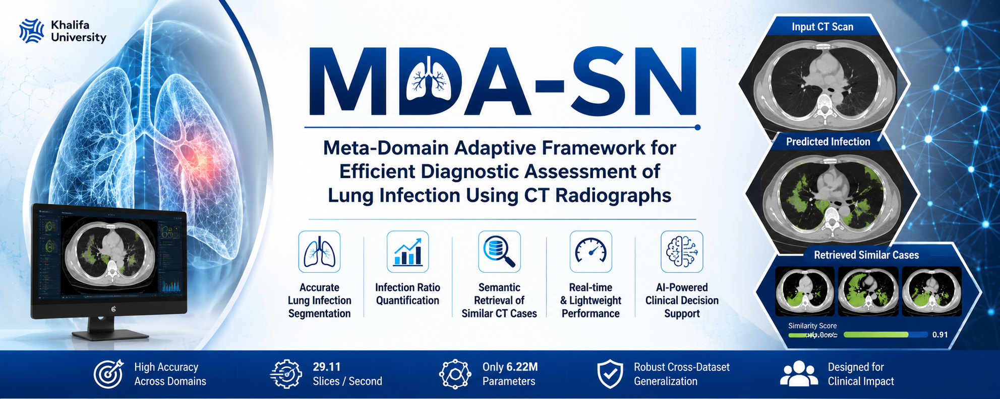
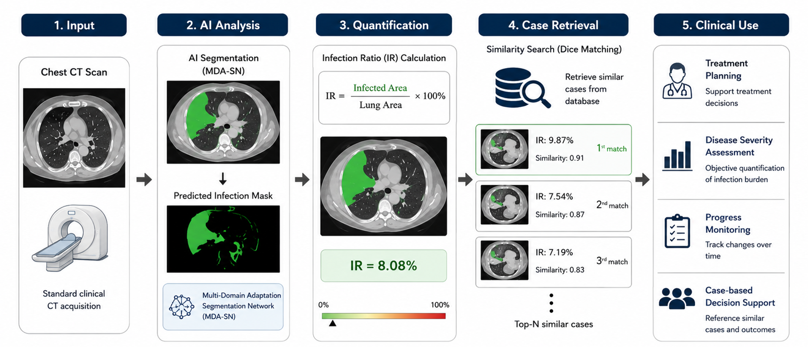
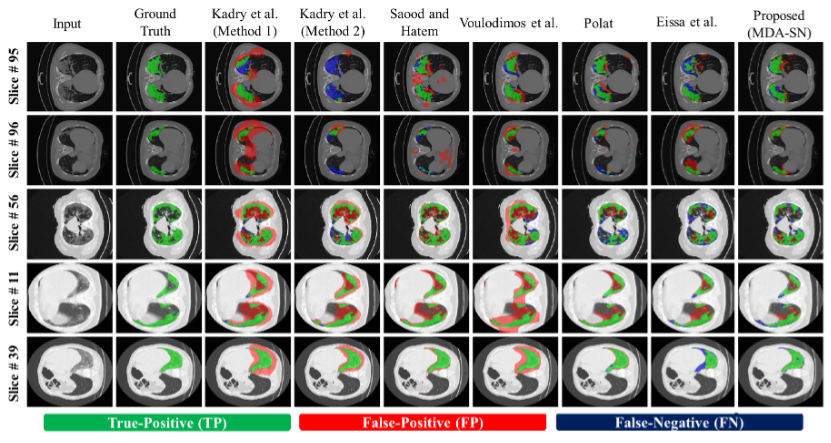
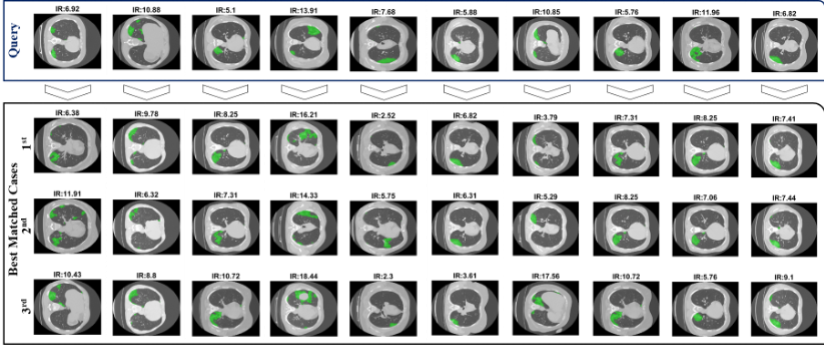

# MDA-SN

<p align="center">
  
</p>

<h2 align="center">
Meta-Domain Adaptive Framework for Efficient Diagnostic Assessment of Lung Infection Using CT Radiographs
</h2>

<p align="center">
  <b>Lightweight AI framework for lung infection segmentation, infection ratio quantification, and semantic retrieval of clinically similar CT cases.</b>
</p>

<p align="center">
  <a href="#"></a>
  <a href="#"></a>
  <a href="#"></a>
  <a href="#"></a>
  <a href="#"></a>
</p>

---

## Overview

This repository provides the algorithmic framework and implementation details of **MDA-SN**, a lightweight **Meta-Domain Adoptive Segmentation Network** for automated lung infection analysis from CT images.

The proposed framework performs:

- Lung region segmentation
- Infection region segmentation
- Infection Ratio (IR) quantification
- Semantic attention-driven retrieval of similar CT slices
- Dice-based similarity matching
- Cross-dataset diagnostic assessment

The framework is designed to support efficient, explainable, and reproducible computer-aided diagnostic assessment of lung infections from CT scans.

---

## Graphical Abstract

<p align="center">
  
</p>

---

## High-Level Workflow

```text
Input Chest CT Scan
        │
        ▼
Adaptive Data Normalization
        │
        ▼
MDA-SN Segmentation Network
        │
        ├── Lung Region Segmentation
        │
        └── Infection Region Segmentation
        │
        ▼
Infection Ratio Calculation
        │
        ▼
Dice-Based Similarity Matching
        │
        ▼
Top-N Similar CT Case Retrieval
        │
        ▼
Clinical Decision Support
```

---

## Key Contributions

| No. | Contribution |
|---|---|
| 1 | A lightweight Meta-Domain Adoptive Segmentation Network for lung infection segmentation in CT scans. |
| 2 | Adaptive Data Normalization strategy to reduce domain shift across CT datasets. |
| 3 | Multi-scale dilated grouped convolution with residual attention for efficient lesion localization. |
| 4 | Infection Ratio calculation for quantitative infection severity assessment. |
| 5 | Semantic attention-driven retrieval framework for retrieving clinically similar CT slices. |
| 6 | Real-time performance with approximately 29 slices per second and only 6.22M parameters. |

---

## Method Summary

### 1. Adaptive Data Normalization

The proposed ADN strategy aligns the visual distribution of testing CT slices with the training domain to improve cross-dataset generalization.

### 2. MDA-SN Segmentation

MDA-SN uses:

- Residual blocks
- Stride blocks
- Atrous/dilated convolution block
- Residual attention
- Lightweight decoder

### 3. Infection Ratio Quantification

The infection burden is computed as:

```text
IR = Infected Area / Lung Area × 100
```

### 4. Similar CT Case Retrieval

The predicted infection mask of the query CT slice is compared with database masks using Dice similarity.

```text
Dice = 2 × |Query Mask ∩ Retrieval Mask| / (|Query Mask| + |Retrieval Mask|)
```

The top-ranked CT slices are retrieved as clinically similar cases.

---

## Datasets

The proposed framework was evaluated on two publicly available CT datasets.

| Dataset | Description | Annotation |
|---|---|---|
| COVID-19-CT-Seg | CT slices from COVID-19 patients | Lung and infection masks |
| MosMed | COVID-19 CT scans with infection annotations | Infection masks |

---

## Experimental Setup

| Item | Details |
|---|---|
| Software | MATLAB R2020b |
| GPU | NVIDIA GeForce GTX 1070 |
| CPU | Intel Core i7 |
| RAM | 16 GB |
| Optimizer | Stochastic Gradient Descent |
| Initial Learning Rate | 0.001 |
| Evaluation Metrics | SEN, SPE, Dice, IoU |
| Validation | Five-fold cross-validation |

---

## Main Results

### Within-Dataset Performance

| Experiment | Dataset | SEN (%) | SPE (%) | Dice (%) | IoU (%) |
|---|---|---:|---:|---:|---:|
| Experiment 1 | COVID-19-CT-Seg | 92.46 | 99.12 | 83.37 | 75.01 |
| Experiment 2 | MosMed | 89.65 | 99.41 | 69.18 | 61.81 |

---

### Cross-Dataset Performance

| Setting | SEN (%) | SPE (%) | Dice (%) | IoU (%) |
|---|---:|---:|---:|---:|
| Without ADN | 63.68 | 99.34 | 71.23 | 63.22 |
| With ADN | 67.91 | 99.64 | 75.93 | 67.42 |

---

## Computational Efficiency

| Method | Parameters | Speed | FLOPs |
|---|---:|---:|---:|
| Proposed MDA-SN | 6.22M | 29.11 slices/s | 28.26 |

---

## Visual Results

<p align="center">
  
</p>

---

## Retrieval Results

<p align="center">
  
</p>

---

## Algorithmic Workflow

### Training Phase

1. Load training CT images and corresponding masks.
2. Initialize MDA-SN using pretrained weights.
3. Train the model using weighted cross-entropy loss.
4. Optimize parameters using stochastic gradient descent.
5. Save the trained model.

### Testing Phase

1. Load the testing CT slice.
2. Apply adaptive data normalization.
3. Predict lung and infection masks using trained MDA-SN.
4. Compute segmentation metrics.
5. Estimate infection ratio.

### Retrieval Phase

1. Use the predicted infection mask as the query.
2. Compare the query mask with database masks.
3. Compute Dice similarity scores.
4. Rank database slices based on similarity.
5. Retrieve top-N matched CT cases.

---

## Applications

| Application | Description |
|---|---|
| Lung infection assessment | Automatic localization of infection regions in CT scans. |
| Infection severity estimation | Quantitative infection ratio calculation. |
| Clinical monitoring | Tracking infection burden over time. |
| Case-based retrieval | Retrieval of similar CT cases from the database. |
| Decision support | Supporting clinicians with objective AI-based analysis. |

---

## Code Availability

The algorithmic framework and implementation details underlying the proposed method are publicly available at:

https://github.com/Owais-CodeHub/MDA-SN

This repository includes the methodological workflow, model design, adaptive data normalization strategy, infection ratio quantification procedure, and semantic retrieval framework used to generate the results reported in the study. There are no restrictions on access to these materials.

---

## Algorithmic Workflow

The proposed MDA-SN framework consists of three main phases: training, testing, and retrieval.

### Step 1: Training Phase

```text
Input:
- Training CT images
- Corresponding lung and infection masks

Process:
1. Load training CT scans and ground-truth masks.
2. Initialize the MDA-SN model.
3. Train one model for lung region segmentation.
4. Train another model for infection region segmentation.
5. Optimize the model using weighted segmentation loss.
6. Save the trained MDA-SN models.

Output:
- Trained lung segmentation model
- Trained infection segmentation model
```

### Step 2: Testing Phase

```text
Input:
- Test CT scan
- Trained MDA-SN models

Process:
1. Apply adaptive data normalization to reduce domain variation.
2. Generate the lung segmentation mask.
3. Generate the infection segmentation mask.
4. Remove non-lung regions from the infection mask.
5. Produce the final infection prediction map.

Output:
- Predicted lung mask
- Predicted infection mask
```

### Step 3: Infection Ratio Quantification

```text
Input:
- Predicted lung mask
- Predicted infection mask

Process:
1. Count the total number of lung pixels.
2. Count the total number of infected pixels.
3. Calculate infection ratio using:

   Infection Ratio = (Infected Area / Lung Area) × 100

Output:
- Infection Ratio percentage
```

### Step 4: Semantic Retrieval Phase

```text
Input:
- Query infection mask
- Database of CT masks

Process:
1. Compare the query mask with each database mask.
2. Calculate Dice similarity score for each comparison.
3. Rank all database CT slices based on Dice similarity.
4. Select the Top-N most similar CT cases.
5. Retrieve corresponding CT images and infection ratios.

Output:
- Top-N clinically similar CT cases
- Dice similarity scores
- Infection ratio values
```

### Step 5: Clinical Output

```text
Final Output:
- Segmented lung region
- Segmented infection region
- Infection ratio score
- Retrieved similar CT cases
- Case-based support for diagnostic assessment
```
---

## Paper Information

**Title:**  
Meta-Domain Adaptive Framework for Efficient Diagnostic Assessment of Lung Infection Using CT Radiographs

**Authors:**  
Muhammad Owais, Taimur Hassan, Naqash Afzal, Saddam Hussain Khan, Divya Velayudhan, Iyyakutti Iyappan Ganapathi, Irfan Hussain, and Naoufel Werghi

**Corresponding Author:**  
Muhammad Owais  
Khalifa University Center for Autonomous Robotic Systems, Khalifa University, Abu Dhabi, UAE  
Email: muhammad.owais@ku.ac.ae

---

## Citation

```bibtex
@article{owais2026mdasn,
  title={Meta-Domain Adaptive Framework for Efficient Diagnostic Assessment of Lung Infection Using CT Radiographs},
  author={Owais, Muhammad and Hassan, Taimur and Afzal, Naqash and Khan, Saddam Hussain and Velayudhan, Divya and Ganapathi, Iyyakutti Iyappan and Hussain, Irfan and Werghi, Naoufel},
  journal={Scientific Reports},
  year={2026}
}
```

---

## License

This repository is released for academic and research purposes.

---

## Contact

For questions, please contact:

**Muhammad Owais**  
Khalifa University, Abu Dhabi, UAE  
Email: muhammad.owais@ku.ac.ae  
GitHub: https://github.com/Owais-CodeHub
